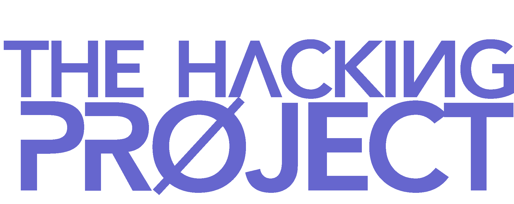

---

  
  &nbsp;&nbsp;&nbsp;
  
  &nbsp;&nbsp;&nbsp;
  

---

  
  &nbsp;&nbsp;&nbsp;
  
  &nbsp;&nbsp;&nbsp;
  
  &nbsp;&nbsp;&nbsp;
  
  &nbsp;&nbsp;&nbsp;
  
  &nbsp;&nbsp;&nbsp;
  
  &nbsp;&nbsp;&nbsp;
  
  
  &nbsp;&nbsp;&nbsp;
  

---

## FullStack Training

Here is the repository of all my projects from the FullStack bootcamp training at [The Hacking Project](https://www.thehackingproject.org/): 9 intense weeks in bootcamp.

## :chart_with_upwards_trend: Training program

### [:heavy_check_mark: **Week 1:** Object-Oriented Programming](https://github.com/BenjaminCharmes/THP_FullStack/tree/main/Week_1)

- [**Day 1:** Discovering OOP](https://github.com/BenjaminCharmes/THP_FullStack/tree/main/Week_1/Day_1)
- [**Day 2:** Further into OOP](https://github.com/BenjaminCharmes/THP_FullStack/tree/main/Week_1/Day_2)
- [**Day 3:** Playing with excels](https://github.com/BenjaminCharmes/THP_FullStack/tree/main/Week_1/Day_3)
- [**Day 4:** OOP of Champions: tic-tac-toe](https://github.com/BenjaminCharmes/THP_FullStack/tree/main/Week_1/Day_4)
- [**Day 5:** MVC - Ruby Version](https://github.com/BenjaminCharmes/THP_FullStack/tree/main/Week_1/Day_5)

### [:heavy_check_mark: **Week 2:** Introduction to Rails](https://github.com/BenjaminCharmes/THP_FullStack/tree/main/Week_2)

- [**Day 1:** Sinatra](https://github.com/BenjaminCharmes/THP_FullStack/tree/main/Week_2/Day_1)
- [**Day 2:** Discovering SQL](https://github.com/BenjaminCharmes/THP_FullStack/tree/main/Week_2/Day_2)
- [**Day 3:** Switching from SQL to ActiveRecord](https://github.com/BenjaminCharmes/THP_FullStack/tree/main/Week_2/Day_3)
- [**Day 4:** Relationships between DataBase](https://github.com/BenjaminCharmes/THP_FullStack/tree/main/Week_2/Day_4)
- [**Day 5:** Validations & Database Designs](https://github.com/BenjaminCharmes/THP_FullStack/tree/main/Week_2/Day_5)

### [:heavy_check_mark: **Week 3:** Intermediate Rails](https://github.com/BenjaminCharmes/THP_FullStack/tree/main/Week_3)

- [**Day 1:** Discovering Rails](https://github.com/BenjaminCharmes/THP_FullStack/tree/main/Week_3)
- [**Day 2:** Using routes and forms](https://github.com/BenjaminCharmes/THP_FullStack/tree/main/Week_3)
- [**Day 3:** CRUD](https://github.com/BenjaminCharmes/THP_FullStack/tree/main/Week_3)
- [**Day 4:** Pimp of the Gossip Project](https://github.com/BenjaminCharmes/THP_FullStack/tree/main/Week_3)
- [**Day 5:** Improve a site with login & Cookies 🍪](https://github.com/BenjaminCharmes/THP_FullStack/tree/main/Week_3)

### [:heavy_check_mark: **Week 4:** Advanced Rails](https://github.com/BenjaminCharmes/THP_FullStack/tree/main/Week_4)

- [**Day 1:** Mailer and events](https://github.com/BenjaminCharmes/THP_FullStack/tree/main/Week_4)
- [**Day 2:** Devise](https://github.com/BenjaminCharmes/THP_FullStack/tree/main/Week_4)
- [**Day 3:** Services and APIs](https://github.com/BenjaminCharmes/THP_FullStack/tree/main/Week_4)
- [**Day 4:** Asset Pipeline & Active Storage](https://github.com/BenjaminCharmes/THP_FullStack/tree/main/Week_4)
- [**Day 5:** Administrator interface](https://github.com/BenjaminCharmes/THP_FullStack/tree/main/Week_4)

### [:heavy_check_mark: **Week 5:** HTML / CSS](https://github.com/BenjaminCharmes/THP_FullStack/tree/main/Week_5)

- [**Day 1:** The basics of Front End](https://github.com/BenjaminCharmes/THP_FullStack/tree/main/Week_5/Day_1)
- [**Day 2:** Molecules and organisms ⚛](https://github.com/BenjaminCharmes/THP_FullStack/tree/main/Week_5/Day_2)
- [**Day 3:** Rails, front, and components](https://github.com/BenjaminCharmes/THP_FullStack/tree/main/Week_5/Day_3)
- [**Day 4:** JavaScript: the basics](https://github.com/BenjaminCharmes/THP_FullStack/tree/main/Week_5/Day_4)
- [**Day 5:** Playing with the DOM](https://github.com/BenjaminCharmes/THP_FullStack/tree/main/Week_5/Day_5)

### [:heavy_check_mark: **Week 6:** Front-end JavaScript](https://github.com/BenjaminCharmes/THP_FullStack/tree/main/Week_6)

- [**Day 1:** Reacting to events in JS](https://github.com/BenjaminCharmes/THP_Introduction/tree/main/Week_3/Day_1)
- [**Day 2:** JavaScript in a Rails application](https://github.com/BenjaminCharmes/THP_Introduction/tree/main/Week_3/Day_2)
- [**Day 3:** AJAX (1/2)](https://github.com/BenjaminCharmes/THP_Introduction/tree/main/Week_3/Day_3)
- [**Day 4:** AJAX (2/2)](https://github.com/BenjaminCharmes/THP_Introduction/tree/main/Week_3/Day_4)
- [**Day 5:** Teamwork and Git workflow](https://github.com/BenjaminCharmes/THP_Introduction/tree/main/Week_3/Day_5)

### [:heavy_check_mark: **Week 7:** Project: online shop](https://github.com/BenjaminCharmes/THP_FullStack/tree/main/Week_7)

- [**Sammy Shop**](https://github.com/BenjaminCharmes/THP_Introduction/tree/main/Week_3/Day_1)

### [:heavy_check_mark: **Week 8 & 9:** Final Project](https://github.com/BenjaminCharmes/THP_FullStack/tree/main/Week_8_%26_9)

- [**Mojo Coaching**](https://github.com/BenjaminCharmes/THP_FullStack/tree/main/Week_8_%26_9)

## 🚨 - Disclaimer

The majority of these projects are those of a beginner, and are therefore not perfect or optimal. The training is intense, so it is difficult to come back later to a past project to improve it.

All advice is welcome 😊

## 📫 - Contact me

If you wish to contribute to the improvement of this repository or if you simply have questions, you can contact me on these networks:

&nbsp;&nbsp;&nbsp;

&nbsp;&nbsp;&nbsp;

